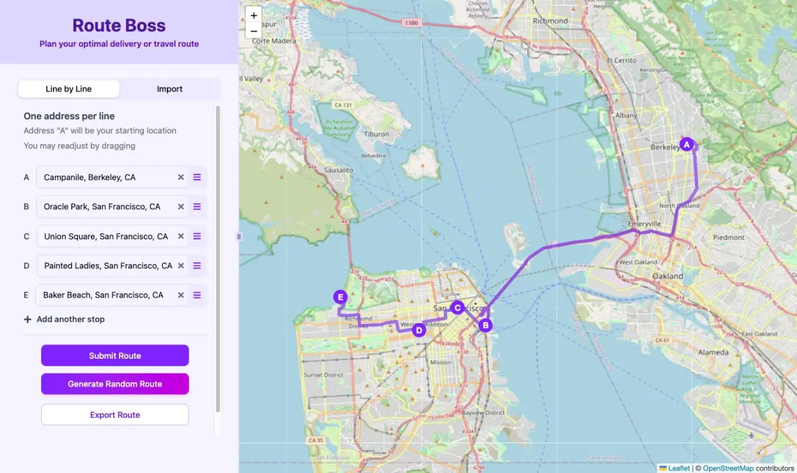

# Route Boss

**Route Boss** is a route planning web app built with Next.js 15 (App Router) and React 19, styled with Tailwind CSS and shadcn/ui. Enter or import delivery or travel stops, get them geocoded and put in an efficient order, see the route on a map, and export it as a PDF or open it in Google Maps (directly, or from a QR code on desktop).

## 🌐 Live Demo

https://route-planner-nextjs.vercel.app

Press **Generate Random Route** to try it with five random Bay Area landmarks.

## 💡 Features

Two input modes:
* Line-by-line address entry, with drag-to-reorder. The first address (**A**) is the starting point.
* File import from `.csv`, `.xls`, or `.xlsx` (up to 1 MB). The header row needs either an `Address` column, or `Street` and `City` columns (`State` and `Zip` optional). Header names are matched ignoring case, spaces, dashes, and underscores, and common variants such as `Zip Code`, `Postal Code`, or `Town` also work.

Geocoding:
* Addresses are turned into coordinates with [Nominatim](https://nominatim.org/) (OpenStreetMap). No API key needed.
* Addresses that can't be found stay in your list and are named in a message, so you can fix them and resubmit.

Route optimization:
* [OpenRouteService](https://openrouteservice.org/) finds an efficient stop order, starting from stop A, and draws the road route on the map.

Interactive map:
* [Leaflet](https://leafletjs.com/) with OpenStreetMap tiles
* Stops labeled **A**, **B**, **C**, … in route order
* The road route is drawn as a line over the map
* A loading spinner shows while the route is being built

Layout:
* Phones get a **Stops / Map** switch: submitting jumps to the map, and the route opens in Google Maps from the Export button
* Tablets and desktops get two resizable columns (addresses and map), with the address column wider on smaller screens

Export:
* Download a **PDF** listing the stops in route order
* Open the route in **Google Maps**: a button opens it directly (the Google Maps app on phones that have it), and on desktop a **QR code** sends it to your phone

Limits:
* US addresses only (geocoding is restricted to the United States)
* Up to 25 stops per route
* Each visitor is rate-limited (10 requests a minute and 100 a day per API route) to protect the free API quotas

## 📝 Tech Stack

| Layer | Technology |
| --- | --- |
| Framework | Next.js 15 (App Router), React 19, JavaScript |
| Styling | Tailwind CSS v4 + shadcn/ui |
| Map | Leaflet via react-leaflet, OpenStreetMap tiles |
| Geocoding | Nominatim (OpenStreetMap) |
| Optimization and routing | OpenRouteService |
| File import | react-dropzone, papaparse, xlsx |
| Drag to reorder | dnd-kit |
| PDF | jsPDF |
| QR code | next-qrcode |
| Hosting | Vercel |

All calls to external APIs go through the app's own server routes in `src/app/api/`, so the OpenRouteService key never reaches the browser. See [ARCHITECTURE.md](ARCHITECTURE.md) for how the pieces fit together.

## ⚖️ Folder Structure

```bash
src
├── app
│   ├── layout.js          # Root layout and page metadata
│   ├── page.js            # The single page: state, route building, layout
│   └── api                # Server routes that proxy the external APIs
│       ├── geocode        #   Nominatim, rate-limited to 1 lookup/second
│       ├── optimize       #   OpenRouteService optimization
│       └── route          #   OpenRouteService directions (road route)
├── components
│   ├── AddressForm        # Line-by-line entry, Submit / Generate / Export
│   ├── ImportForm         # Drag-and-drop file import and parsing
│   ├── MapDisplay         # Leaflet map, markers, and route line
│   ├── ExportModal.jsx    # PDF download, Google Maps link, and QR code (desktop)
│   ├── ClientOnly.jsx     # Renders children only after mount
│   └── ui                 # shadcn/ui components
├── hooks
│   └── useMediaQuery.js   # Screen-width checks that pick the layout
├── lib
│   ├── apiGuard.js        # Same-origin check and per-IP rate limits
│   ├── routeInput.js      # Input validation for the routing APIs
│   └── utils.js           # shadcn's cn() class helper
└── utils                  # Client helpers that call the API routes, PDF and Maps URL helpers
```

## ⚙️ Getting Started

1. Install dependencies:

   ```bash
   npm install
   ```

2. Sign up at https://openrouteservice.org for a free API key, then create `.env.local`:

   ```bash
   ORS_API_KEY=your_openrouteservice_api_key
   ```

   Geocoding (Nominatim) needs no key. Without `ORS_API_KEY` the app builds and geocodes, but optimization and road routes return errors.

3. Start the development server:

   ```bash
   npm run dev
   ```

   Then open http://localhost:3000.

Other commands:

| Purpose | Command |
| --- | --- |
| Lint | `npm run lint` |
| Production build | `npm run build` |

Please keep testing light: Nominatim allows at most one request per second, and the OpenRouteService free plan has a small daily quota.

## Licence

MIT
