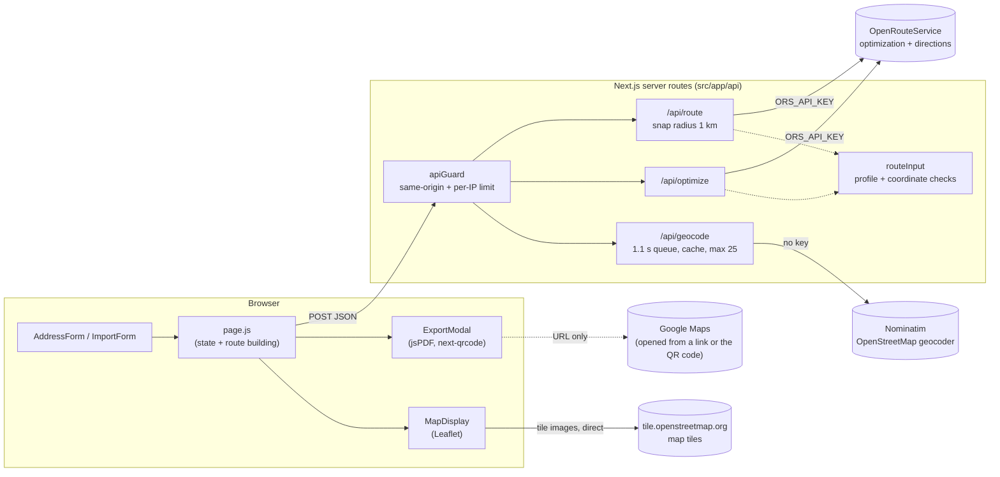
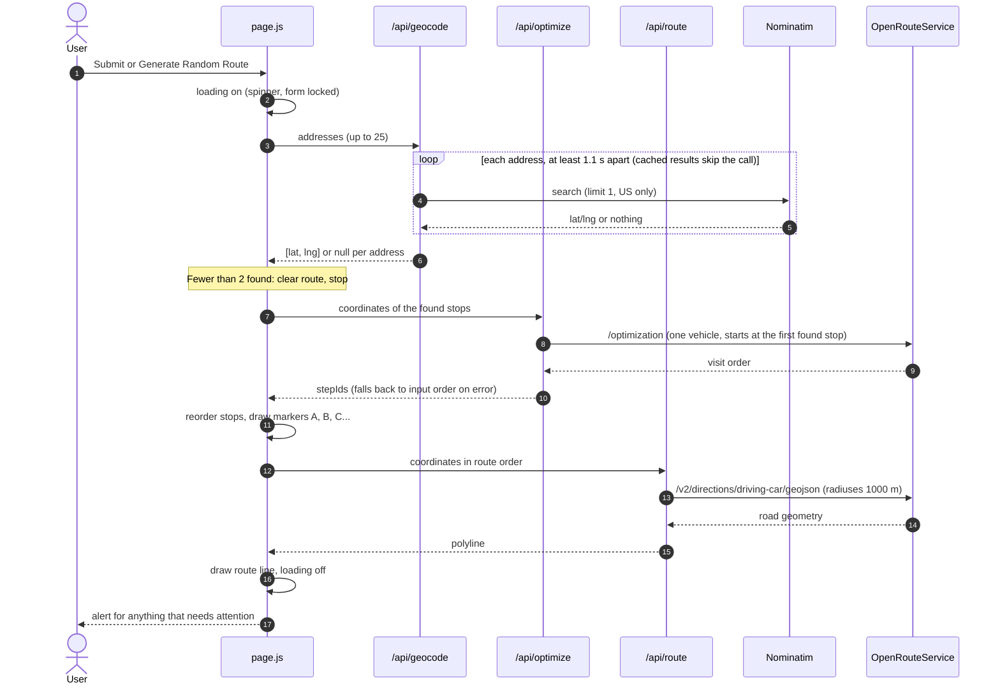
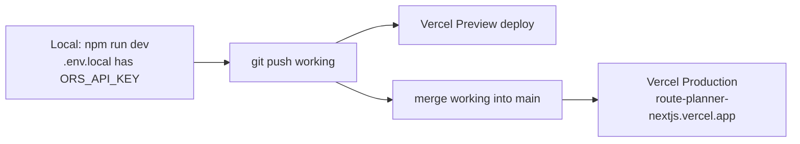

# Architecture

Route Boss is a single-page Next.js 15 app (App Router, plain JavaScript). The
browser does the UI, map rendering, file parsing, and exports. Three server
routes in `src/app/api/` proxy the external APIs the app uses, so the
OpenRouteService key stays on the server and those calls are checked and
rate-limited in one place. The app has no database: route state lives in React
state in the browser, and the only server-side state is in-memory caches and
counters.

## System overview

Map tiles are the one outside request that doesn't go through `src/app/api/`;
they need no key, and the browser loads them directly. The Google Maps link
(Google's documented `api=1` directions URL, driving) is offered as an "Open in
Google Maps" button and, on desktop, a QR code; the app never calls Google.

## Building a route

Submit and Generate Random Route both call `submitRoute` in `src/app/page.js`.
On phones it first switches to the Map view, and back to Stops if the route
fails; on any screen it then calls `geocodeAndSet`, which sets a loading flag
(spinner over the map, the clicked button reads "Loading...", the form is
locked) and ignores further submits until it finishes. Then it runs three
steps in order:

Every request to the three routes first passes `guardRequest` (`src/lib/apiGuard.js`):

- **Same-origin check:** the `Origin` header must match the host the request
  was sent to, or the route returns 403.
- **Per-IP rate limit:** 10 requests a minute and 100 a day per route, or the
  route returns 429 with `Retry-After`.

`/api/optimize` and `/api/route` then validate their input with
`parseRouteInput` (`src/lib/routeInput.js`): the profile must be `driving-car`,
there must be 2–25 stops, and each must be a valid `[lat, lng]`. Bad input
gets a 400 before anything reaches ORS.

## Front-end state

All route state is in `Home` (`src/app/page.js`):

| State | Holds |
| --- | --- |
| `addresses` | What the form shows: routed stops in route order, then any addresses that weren't found |
| `coordinates` | `[lat, lng]` of the routed stops, in route order (markers, Google Maps link and QR code) |
| `roadPolyline` | Road geometry from `/api/route` (the route line) |
| `routedAddresses` | Addresses of the routed stops, in route order (the PDF) |
| `loading` | True while a route is being built |
| `mobileView` | `'stops'` or `'map'`: which view the phone layout shows |

`isMobile`, `isTablet`, and `isSmallLaptop` come from `useMediaQuery`
(`src/hooks/useMediaQuery.js`) and pick the layout; they aren't stored state.

`coordinates` and `routedAddresses` are set together and cleared together when
a submit fails, so the map, the PDF, and the Google Maps link always describe the same
route. Export is offered only while stops are on the map. `MapDisplay` refits
the view only when a new route arrives, not on unrelated re-renders.

## Layout

The header, the stops panel (tabs and form), and the map panel are built once
in `page.js` and placed in one of two layouts:

- **Below 768px:** a Stops / Map switch. Both views stay mounted and the
  inactive one is hidden with CSS, so the form and map keep their state. The
  map view has its own Export button, and the Export dialog puts "Open in
  Google Maps" first and hides the QR code. The layout is pinned to the
  screen (`fixed inset-0`) so only the stops list scrolls, and `html`/`body`
  have `overscroll-behavior: none` with a violet background. Without that,
  iOS passed swipes past the end of the list on to the page, which hid the
  header, triggered pull-to-refresh, and showed a white background.
- **768px and up:** the resizable two columns. The address column starts at 50%
  (768–1023px), 40% (1024–1279px), or 30% (1280px+); the panel group is keyed
  on that size because `defaultSize` only applies on mount.

Crossing 768px swaps layouts, and crossing 1024px or 1280px remounts the
columns, so the divider position and map view reset. Leaflet only reacts to
window resizes, so `MapDisplay` watches its own container with a
`ResizeObserver` and calls `invalidateSize()` when the container is resized or
shown. A route that arrives while the map is hidden (0×0, e.g. switching from
the desktop to the phone layout on the Stops view) isn't fitted then, because
Leaflet would pick its maximum zoom; it's fitted once the map has a size.

## When things go wrong

| Situation | What the user sees |
| --- | --- |
| Some addresses not found | Route for the rest; the missing ones stay at the end of the list and are named in an alert |
| Fewer than 2 addresses found | Alert; previous route cleared |
| Nominatim error | Alert "Address lookup is temporarily unavailable…" (502 from `/api/geocode`) |
| Optimization fails | Stops shown in the order entered; an alert if it was a quota or rate limit |
| A stop more than 1 km from a road | Markers in the order entered, with no route line and no message (ORS can't route it) |
| ORS quota used up (403/429) | Alert that the routing service is unavailable; the server logs the ORS response |
| Too many requests from one visitor | Alert to wait a minute, or that the daily limit is reached |
| File with no usable columns | Alert explaining the accepted columns |

## Server-side state and limits

All of these live in memory in each server instance. Vercel can run several
instances, and each has its own copy, so these limits stop casual misuse but
are not hard guarantees.

| What | Where | Notes |
| --- | --- | --- |
| Geocode cache | `/api/geocode` | Keyed by country and address; stores results, including "not found"; no size limit yet |
| Nominatim spacing | `/api/geocode` | One shared queue, ≥1.1 s between lookups, per Nominatim's usage policy |
| Rate-limit counters | `apiGuard.js` | Per route and IP; past 5,000 keys, idle keys are dropped first, then the least recently used |

## Deployment

`ORS_API_KEY` is set in the Vercel project's environment variables. There's no
CI and no test suite; lint and build are the checks (see `CLAUDE.md`).

## Known gaps

The open items are tracked in `docs/todo.md`. The architectural ones:

- Rate limits and the Nominatim queue are per server instance, not shared.
- There are no timeouts on outgoing calls to ORS or Nominatim.
